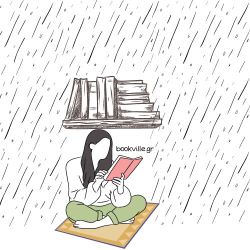

# Hello 👋

***Ονομάζομαι Τάσος και αυτό είναι το github profile μου.***    
(**Current state**) Ασχολούμαι ενεργά με το web development και ψάχνω διαρκώς τρόπους να εξελίξω την "τέχνη" μου.  
Βασικός μου τομέας είναι το Backend Web Development, ενώ έχω οικειότητα και με Frontend τεχνολογίες.  
Στόχος των εφαρμογών μου είναι να λύσουν προβλήματα του πραγματικού κόσμου, με υψηλή απόδοση και αξιοπιστία.  

Περίφανος Junior 💪.

## Projects που αναμειγνύομαι ενεργά
\-

## Projects στον πάγο
➡️ [Bookville.gr]()  

Open Source εφαρμογή για διαχείριση αποθέματος βιβλιοπωλείων, αλλά και για διευκόλυνση του καταναλωτή.  
Στη διαδικασία του reboot  

## Projects που υπήρξαν
➡️ [Smartbell.gr]()  

Εφαρμογή για πλήρη διαχείριση καταστημάτων εστίασης.  

## TL;DR
> Μου αρέσει να μαθαίνω πράγματα, εθίζομαι εύκολα σε τεχνολογίες και φτιάχνω καλό καφέ.

## Τεχνολογίες που "ξέρω" να χρησιμοποιώ 🔓

| Τεχνολογία | Γνώση/10 |
| :---: | :---: |
|***Operating Systems***||
| Windows Usage | 8 |
| Linux (Ubuntu based) Usage | 7 |
| Bash Scripting | 4 |
| ***Version Control*** ||
| Git | 7 |
| ***Programming Lanuages*** ||
| Python | 7 |
| Javascript | 5 |
| Rust (quite early on) | 4 |
| Kotlin (quite early on) | 4 |
| ***Backend Web Development*** ||
| Django Framework (including REST Framework)| 7 |
| FastAPI | 6 |
| Ktor | 4 |
| Nodejs (fastify) | 4 |
| ASP.NET Core | 3 |
| Axum | 2 |
| ***Relational Databases*** ||
| Relational DB Theory | 7 |
| Different ORMs (Django ORM/ SQLAlchemy etc) | 7 |
| SQLite | 5 |
| PostgreSQL | 4 |
| Larger Scale DB applications | 4 |
| ***In memory Databases***||
| Current Understanding | 4 |
| Redis | ? |
| RabbitMQ | 5 |
| ***Frontend Web Development*** ||
| HTML, CSS, JS | 6 |
| Bootstrap | 6 |
| Tailwind CSS | 6 |
| JS Frameworks / Libraries (only tried ReactJs for a month...) | 3 |
| ***Deployment and Infra Management*** ||
| Linux VM | 6 |
| Docker | 5 |
| PaaS(Heroku, CapRover) | 4 |
| ***Other*** ||
| Advanced Coffee Brewing ☕ | 8 |
| Techical Writing w/ Markdown | 7 |
| General Purpose Writing | 6 |

## Current SE Bucket List
| Τεχνολογία | Desire/10 |
| :---: | :---: |
| Security on the Web | 8 |
| Better Understanding of Backend Concepts | 7 |
| Expand to the Devops space | 5 |

## Current Addictions
| Technology | Level of Addiction |
| :---: | :---: |
| AstroJs | Medium |
| FastAPI | Quite High |
| Kotlin & Ktor | Getting There |
| Designing apps that will never be complete | Dangerous |

## Μέρη που γράφω για τεχνικά θέματα
> Coming Soon

## Φτάσατε στο τέλος!
> Εσείς; Τα νέα σας!
